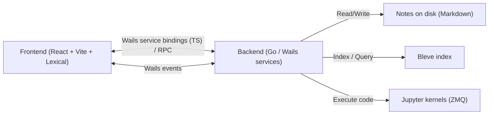

# AGENTS.md

Guidance for coding agents working in this repository (Codex, Claude Code, etc.).

## Project summary

Bytebook is a desktop note-taking app for developers built with **Wails v3**:

- **Go backend** under `internal/`
- **React + TypeScript frontend** under `frontend/`
- Notes are stored as **Markdown files on disk**
- Full-text search uses **Bleve**
- Code execution integrates **Jupyter kernels** (ZeroMQ)

Important: the repo uses a **local fork of Wails v3**. `go.mod` includes a `replace` pointing to `../wails/v3`, so the sibling `wails/` directory must exist for Go builds to work.

## Quick commands

### Dev

```bash
# Repo root (recommended)
task dev

# Direct
wails3 dev -config ./build/config.yml -port 5173
```

### Go backend

```bash
go mod tidy

# All tests (cached)
gotestsum --format=pkgname --format-icons=hivis ./internal/...

# All tests (no cache)
gotestsum --format=pkgname --format-icons=hivis -- -count=1 ./internal/...

# Single package
go test ./internal/search/...
```

### Frontend

```bash
cd frontend
bun install

# Type-check (tsgo)
bun run tsgo

# Lint / format check
bun run lint:check
bun run format:check

# Unit tests
bun run test:unit
```

## Architecture notes

- **Service bindings**: exported Go service methods are registered with Wails and TypeScript bindings are generated into `frontend/bindings/`.
- **Events**: the frontend and backend communicate over the Wails event bus; event name strings are defined centrally in `internal/util/events.go`.
- **Frontend routing**: `wouter` with route URLs in `frontend/src/utils/routes.ts`.
- **Editor**: Lexical-based editor lives under `frontend/src/components/editor/`.

## Pages / routes (frontend)

Routes are wired in `frontend/src/App.tsx` using `wouter` + `routeUrls.patterns` (from `frontend/src/utils/routes.ts`). Key pages:

- `/notes/*` → `EditorWrapper` (main notes/folder view)
- `/search` → `SearchPage` (lazy-loaded)
- `/saved-search/:searchQuery/*` → `SavedSearchPage` (lazy-loaded; supports an optional trailing path)
- `/kernels/:kernelName` → `KernelInfo` (lazy-loaded)
- `/404` and `*` → `NotFound` (lazy-loaded)
- `/` (`ROOT`) currently matches with no component; if you change routing, ensure the root path lands on a meaningful page.

Layout note: `FileSidebar` visibility is toggled in `frontend/src/App.tsx` (hidden when a note is maximized or the location starts with `/search`).

## Key components (frontend)

- `frontend/src/components/editor/index.tsx` (`NotesEditor`): Lexical editor composition (toolbar, note title, rich text surface, and plugins like save, files, code execution, draggable blocks, tables, links, and markdown shortcuts). Save behavior is driven by `SavePlugin` and change handling via `OnChangePlugin` + `debouncedNoteHandleChange(...)`.
- `frontend/src/components/virtualized/virtualized-file-tree/index.tsx` (`VirtualizedFileTree`): Virtualized sidebar tree built with `react-virtuoso`. Flattens hierarchical data (`transformFileTreeForVirtualizedList`), injects a “create folder” row, manages selection clearing on outside click, supports keyboard navigation (`handleFileTreeKeyDown`), and keeps the current route focused/visible (`useRoutePathFocus`).

## Mermaid diagram (high level)



## Working conventions

- Prefer **small, surgical diffs**; avoid drive-by refactors.
- Keep event names in `internal/util/events.go` as the source of truth.
- If you change backend services, ensure generated bindings stay in sync (Wails binding generation).
