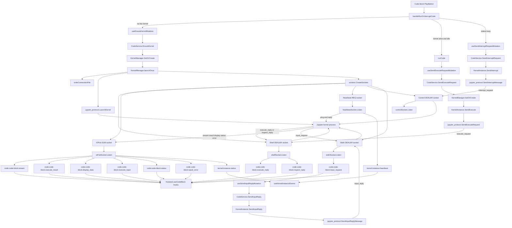
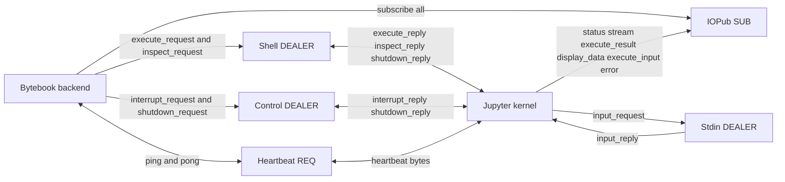

# Code Block Kernel Flow

```mermaid
flowchart TD
  A[Code block PlayButton] --> B[handleRunOrInterruptCode]
  B -->|no live kernel| C[useEnsureKernelMutation]
  C --> D[CodeService.EnsureKernel]
  D --> E[KernelManager.GetOrCreate]
  E --> F[KernelManager.launchOnce]
  F --> G[writeConnectionFile]
  F --> H[jupyter_protocol.LaunchKernel]
  H --> I[Jupyter kernel process]
  F --> J[sockets.CreateSockets]

  J --> S1[Shell DEALER socket]
  J --> S2[IOPub SUB socket]
  J --> S3[Heartbeat REQ socket]
  J --> S4[Control DEALER socket]
  J --> S5[Stdin DEALER socket]

  S1 --> L1[shellSocket.Listen]
  S2 --> L2[ioPubSocket.Listen]
  S3 --> L3[heartbeatSocket.Listen]
  S4 --> L4[controlSocket.Listen]
  S5 --> L5[stdinSocket.Listen]

  B -->|kernel alive and idle| K[runCode]
  K --> M[useSendExecuteRequestMutation]
  M --> N[CodeService.SendExecuteRequest]
  N --> O[KernelManager.GetOrCreate]
  O --> P[KernelInstance.SendExecute]
  P --> Q[jupyter_protocol.SendExecuteRequest]
  Q -->|execute_request| S1
  S1 --> I

  B -->|status busy| R[useSendInterruptRequestMutation]
  R --> T[CodeService.SendInterruptRequest]
  T --> U[KernelInstance.SendInterrupt]
  U --> V[jupyter_protocol.SendInterruptMessage]
  V -->|interrupt_request| S4
  S4 --> I

  I -->|execute_reply or inspect_reply| S1
  L1 --> W1[code:code-block:execute_reply]
  L1 --> W2[code:code-block:inspect_reply]

  I -->|stream result display status error| S2
  L2 --> X1[code:code-block:stream]
  L2 --> X2[code:code-block:execute_result]
  L2 --> X3[code:code-block:display_data]
  L2 --> X4[code:code-block:execute_input]
  L2 --> X5[code:code-block:status]
  L2 --> X6[code:code-block:iopub_error]
  L2 --> X7[kernel:instance:status]

  I -->|input_request| S5
  L5 --> Y1[code:code-block:input_request]
  Y1 --> Y2[useSendInputReplyMutation]
  Y2 --> Y3[CodeService.SendInputReply]
  Y3 --> Y4[KernelInstance.SendInputReply]
  Y4 --> Y5[jupyter_protocol.SendInputReplyMessage]
  Y5 -->|input_reply| S5
  S5 --> I

  L3 -->|ping and reply| I
  L3 --> Z1[kernel:instance:heartbeat]

  X1 --> FE[frontend useCodeBlock hooks]
  X2 --> FE
  X3 --> FE
  X4 --> FE
  X5 --> FE
  X6 --> FE
  Y1 --> FE
  W1 --> FE
  W2 --> FE
  Z1 --> KI[useKernelInstanceEvents]
  X7 --> KI
```

## Socket Summary

```mermaid
flowchart LR
  BB[Bytebook backend] -->|execute_request and inspect_request| Shell[Shell DEALER]
  Shell <-->|execute_reply inspect_reply shutdown_reply| Kernel[Jupyter kernel]

  BB -->|interrupt_request and shutdown_request| Control[Control DEALER]
  Control <-->|interrupt_reply shutdown_reply| Kernel

  BB -->|subscribe all| IOPub[IOPub SUB]
  Kernel -->|status stream execute_result display_data execute_input error| IOPub

  BB <-->|ping and pong| Heartbeat[Heartbeat REQ]
  Heartbeat <-->|heartbeat bytes| Kernel

  Kernel -->|input_request| Stdin[Stdin DEALER]
  Stdin -->|input_reply| Kernel
```
